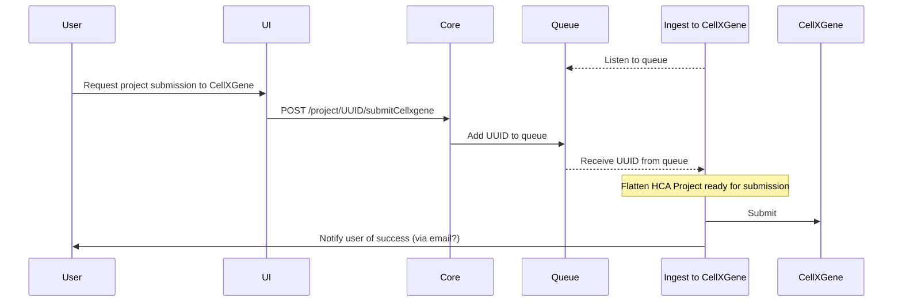

# Sequence Diagram

# Plan
**Phase 1: Semi-manual** (wranglers will be able to run a script to get the flattened output and submit manually)  

1.  Package up lattice-tools (see [this fork](https://github.com/ebi-ait/lattice-tools))
2.  Create a package with a module to convert HCA project metadata into a format for lattice (see [this script](https://github.com/ebi-ait/ingest-cellxgene-submitter/blob/main/hca_cellxgene/hca_lattice.py))
3.  Test run
4.  Create another module to call modules from both (1) and (2) within the `ingest-cellxgene` repo
5.  Dockerize `ingest-cellxgene` and provide instructions for wranglers to use it

**Phase 2: Fully automated**  

1.  Create another script in `ingest-cellxgene` to automatically submit the flattened output and link the whole flow together (I will need help/documentation for this)
2.  Create a queue listener for `ingest-cellxgene` and run the script as a job that listens to that queue
3.  Deploy it in our cluster
4.  Create UI controls for submitting to cell x gene