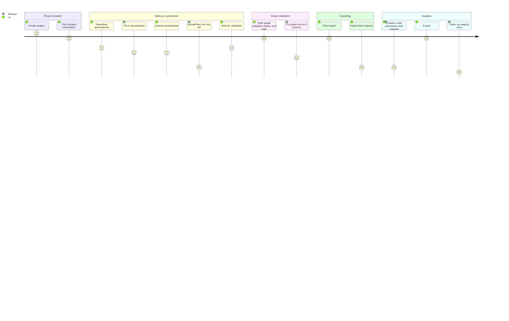
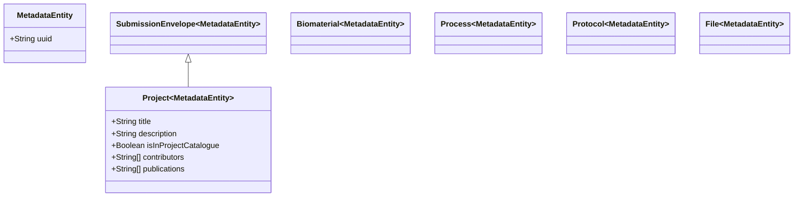

# Refactoring Submission Envelopes
## Current State
### User flow

### Class Diagrams
*Not complete*

### Problems
- **Confusion** between what a submission envelope is and what a project is
- Many "hacks" to work around the desire to export a project and the restriction of exporting a submission envelope:
	- Graph validation of submission using all project information
	- Metadata validation of project information when validating submission metadata
	- Exporting project in reality after triggering export of a submission
	- Post-submission updates (re-exporting a submission)
- We are not using submission envelopes the way they were designed to be used
	- Exemplified by post-submission updates
		- We should not need these
		- Should just edit the metadata and that's it
- It's not easy to see which submission is the most up to date one
- Original intention was to be like a "commit" but that was confusing

## Questions to answer
- Can this flow be explained (easily) to an outside scientist?
	- Probably not
- If a user wants to update a project (even if already in DCP), how can they easily do that?
- Is the language we use useful? "process", "export", "submission"
- How can we reduce the learning curve to use ingest?

## Requirements
- Export data/metadata to data portal
- Allow linking od data/metadata between projects (re-use)
- Bulk upload data/metadata that are not related to eachother
- Know who uploaded data/metadata and when
- Validate each data/metadata individually
- Graph validate how the project looks **before** exporting 

## Original Intention
See [orginal spec](https://docs.google.com/document/u/1/d/13NJdMDq6E8FDyrPebBDD4TEqmI8OXeNkp9ZquqoEhto/edit#heading=h.5caizsfri8tq)

> Coordinate and group related metadata under a single entity, called a “Submission Envelope”

*Note that this is not saying how things are related. We have constrained ourselves by saying data/metadata have to be related through an experiment within a submission. This doesn't have to be true at the submission level, only at the project level. If we stop this constraint we could allow the submission of reusable metadata entities at bulk.*

> Provide a mechanism for users to link Metadata Documents to each other, reflecting the fact that these **metadata may be generated separately over time**

*Ingest fails to do the part in bold at the moment*

> Accommodate several scenarios of data submission; including 
>> 1. A user wants to submit only metadata, 
>> 2. A user wants to submit only Data Files, and link these files to existing Metadata Documents
>> 3. A user wants to submit metadata that refers to bulk data that has not yet been submitted, then submit the relevant bulk data second 
>> 4. A user wants to upload bulk data first, followed by metadata that refers to these bulk data

*Ingest fails to do (2), (3), (4)*

> Allow for the referencing of existing Metadata Documents, both in the same Submission Envelope or in different envelopes, by accession ID, rather than redundant re-uploading of Metadata Documents.

*Ingest partly fails to do this since referencing can only be done in the same project due to graph validation and exporting*

**We don't export a project, we export a submission and retrieve the project information for that submission**. There's a huge difference between what we see in ingest (submissions) and what ends up in HCA (projects).

## Looking forward
SubmissionEnvelopes have now become much more than they were originally intended to be. Essentialy, they now ***encapsulate the current state of a whole project***

### What do we need to do?
- Create projects and attach data/metadata to them
- Update data/metadata in a project (not a submission)
- Export a project (not a submission)
- See the current state of a project (not a submission)
- (stretch) attach data/metadata to any project to allow reuse

### Change mental model from hierachy to tagging
- The current state may have been a result of an OOP/inheritance model (data/metadata are children of submission envelopes) but I think it would be better to think of biomaterials etc. being "tagged" with a submission envelope
- No hierachy, flat structure
	- This is actually how it is in core but the mental model of submission envelopes is not like this
	- data/metadata are created and just tagged with a submission
	- **Important** submissions are *not* tagged with (or part of) a project. Submissions are never part of a project
		- This is because they don't need to be. If we want to allow cross-project entity re-use they cannot be
	- data/metata is tagged as being part of a project later on

### Do we need submission envelopes at all?
- The original intention is valid - to store provenence information about the upload of a set of metadata & data
- The problem is that they now do too much and we use them as if they were the project and not just a subset of files for a project
- They provide useful information such as who performed a given update. Do we need that information though? *Is it fine just have the creator of the project?*
	- How many contributors do we really have for a project? (only our wranglers right now)
	- Even if we had more, do we need to know who did what?
- If we used submission envelopes as intented (to be subsets of data/metadata), it is difficult to gather the current data/metadata for a project
	- Have to crawl through all of the submission envelopes and get the most recent of each data/metadata entity
	- Without submission envelopes, data/metadata can be attached to a project without this but you would lose the project->data/metadata connection for outdated data/metadata. However, the data/metadata->project link could be kept

## Hiding submision envelopes

**Aim**: hide submission envelopes from the user so that they only see the data/metadata of the project as a whole. Use submission envelopes as they were originally intended.

**Secondary aim**: be able to see the current state of the project compared to the state of the project that is exported to DCP.

**Stretch goal**: use submission envelopes to enable full history

### Performing updates

This is the complicated thing. If we're going to use submission envelopes at all, we should really make updates via the UI and via the spreadsheet use them.

Performing updates should be exactly the same method as creating documents and should be the same for via UI or via spreadsheet

#### Update/creation via spreadsheet upload
1. User has a spreadsheet that contains changes to a project
2. They upload the spreadsheet in the UI via the project page
3. All metadata documents are collected (broker)
4. SubmissionEnvelope is created
5. Metadata documents are attached to new submission envelope
6. SubmissionEnvelope is POSTED to `project/<uuid>`
7. Options:
	1.  If we don't want to preserve UUIDs:
		1. Core creates new MetadataDocument(s) for this update and attaches it to the SubmissionEnvelope and project
	2. If we do want to preserve UUIDs:
		1. Core finds the updated metadata documents using other unique identifiers (e.g. name) and performs the update
			
#### Update via form UI
1. User wishes to update a project via the UI
2. They click edit on a entity in the UI
3. Original entityt is copied and updates applied to it
4. SubmissionEnvelope created
5. Updated entity is attached to new submission envelope
6. SubmissionEnvelope is POSTED to `project/<uuid>`
7. Options:
	1.  If we don't want to preserve UUIDs:
		1. Core creates new MetadataDocument for this update and attaches it to the SubmissionEnvelope and project
	2. If we do want to preserve UUIDs:
		1. Core finds the updated metadata documents using other unique identifiers (e.g. name) and performs the update

### Facilitating seeing diff of exported and non-exported
- Give MetadataDocument an `outdated` property
- When a MetadaDocument is updated the `outdated` property gets filled with the `content` of the previous version of itself
- When the MetadataDocument is exported, this property is cleared

### Affected components
#### Ingest UI
- Need redesigns of user flows for data/metadata upload, exporting, validation

#### Ingest Core
- I don't think it needs much changing since we're not removing submission envelope
- Move all graph validation/export/import endpoints to the project level
- Updates for performing updates
- Endpoint to see what is currently exported/not exported
	- Flag metadata documents themselves as exported/not-exported
	- When a metadata document is updated, flag as not-exported
	- Create endpoints to achieve diffing
		- `project/<uuid>/exportedEntities`
		- `project/<uuid>/unexportedEntitites

#### State tracker
- Do we move state tracking to the project level?
	- Is that harder than just removing the state tracker?
	- I think we can maybe get rid of the state tracker and use mongo directly as persistence of state

#### Broker
- Need to update the importer to import to the project level

#### Exporter
Just change to start directly from the project rather than looking up project from submission UUIDs

#### Graph validator
Just change to start directly from the project rather than looking up project from submission UUIDs

#### Validator
- Any changes?
- Validates a metadata document so I think no

